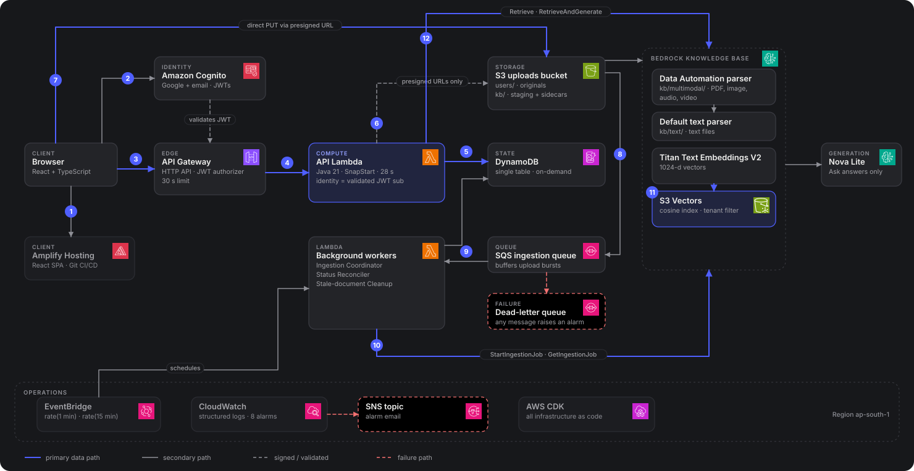

<div align="center">

# Recollect

### Your digital life, remembered.

Upload screenshots, PDFs, recordings and videos. Later, find them by describing what you remember — or ask a
question and get an answer grounded in your own files, with a source you can open to check.

**[Live demo](https://main.d28nd6lc9fjyiv.amplifyapp.com/)** &nbsp;·&nbsp;
**[Engineering showcase](https://main.d28nd6lc9fjyiv.amplifyapp.com/engineering)** &nbsp;·&nbsp;
Demo video — will be added before submission

Built for the **AWS First Commit Hackathon — Ship It**.

</div>

---

## The problem

People accumulate screenshots, documents, PDFs, receipts, lecture notes, voice memos and videos across devices and
folders. Months later they remember *what was in* a file — not its name or where they saved it. Folder search and
filename search fail exactly when the memory is fuzzy.

## What Recollect does

- **Multimodal uploads** — documents, PDFs, images, audio and video, single or in bulk, into one library.
- **Natural-language search** — describe what you remember ("that AWS credits screenshot"); results show *why* they
  matched, with highlighted snippets and timestamps for audio/video.
- **Grounded answers with citations** — ask a question and get an answer built only from your own files, each backed
  by a source you can open.
- **Conversational follow-ups** — "find my numerical methods assignment", then "explain this assignment" stays on the
  file it found.
- **Safe no-answer** — when your memories don't contain an answer, Recollect says so instead of guessing or showing
  irrelevant nearest neighbours.

## Architecture

<p align="center">
  
</p>

The three canonical diagrams (high-level, upload/ingestion, search/ask) live in [`Docs/diagrams/`](Docs/diagrams/)
and are also shown on the [engineering page](https://main.d28nd6lc9fjyiv.amplifyapp.com/engineering).

**Request path.** Browser → Amplify-hosted React app → Cognito sign-in (Google or email) → API Gateway HTTP API
(JWT authorizer) → Java 21 Lambda with SnapStart.

**Upload and ingestion.** The API signs presigned URLs and the browser uploads **directly to S3**. S3 events flow
through **SQS** (with a DLQ) to an **ingestion coordinator** that stages files and starts a Bedrock Knowledge Base
ingestion job. Bedrock parses (Data Automation for PDFs/images/audio/video, the default parser for text), embeds with
**Titan Text Embeddings V2**, and indexes into **S3 Vectors**. A scheduled reconciler updates document status.

**Retrieval.** `/search` calls Bedrock **`Retrieve`** through a relevance gate — no language model involved.
`/ask` runs a preflight retrieval with the same gate, then **`RetrieveAndGenerate`** with **Amazon Nova Lite**,
scoped to the user's relevant documents.

**State and operations.** DynamoDB owns application metadata (documents, ingestion jobs, ask sessions).
EventBridge schedules reconciliation and stale-document cleanup; CloudWatch alarms notify through SNS.

## AWS services

| Service | Why it is here |
|---|---|
| **Amplify Hosting** | Hosts the React app; deploys on Git push |
| **Cognito** | Managed sign-up/sign-in (Google + email) and JWTs; the source of user identity |
| **API Gateway (HTTP API)** | Cheap JWT-authorized edge with an explicit 30 s integration limit |
| **Lambda + SnapStart (Java 21)** | Pay-per-request API and background workers; SnapStart cuts Java cold starts |
| **S3** | Private original files; the direct-upload target; staging for Knowledge Base parsing |
| **SQS + DLQ** | Buffers upload bursts and absorbs the Knowledge Base's one-ingestion-job-at-a-time limit; failures surface in the DLQ |
| **DynamoDB (on-demand)** | Single-table application state; per-user partitions give structural tenant isolation |
| **Bedrock Knowledge Bases** | Managed chunk → embed → index → retrieve pipeline |
| **Bedrock Data Automation** | Multimodal parsing (PDF, image, audio, video) with timestamps |
| **Titan Text Embeddings V2** | 1024-dimensional embeddings, cosine similarity |
| **S3 Vectors** | Vector store with no cluster to keep running |
| **Amazon Nova Lite** | Low-cost grounded answer generation via `RetrieveAndGenerate` |
| **EventBridge** | Schedules the status reconciler (every minute) and stale-document cleanup (every 15 minutes) |
| **CloudWatch + SNS** | Structured logs and 8 alarms that email on failures, including any DLQ message |
| **AWS CDK (Java)** | All infrastructure as code, deployed through one guarded script |

## Engineering highlights

- **Direct-to-S3 uploads.** The API only signs URLs; upload and download file bytes bypass the API Lambda, so file
  size and burstiness don't shape the API tier.
- **Asynchronous ingestion with backpressure.** SQS decouples upload from indexing; the coordinator handles the
  Knowledge Base's single-active-job constraint without losing files.
- **Two parsing paths.** Multimodal files go through Bedrock Data Automation; text files use the default parser.
- **Server-side tenant isolation.** Identity is the validated JWT `sub`. Retrieval filters, DynamoDB keys and sessions
  are derived from it on the server; clients never supply tenant identifiers, S3 keys, model IDs or Knowledge Base IDs.
- **Corpus-calibrated relevance gate.** Vector search always returns *something*; Recollect drops chunks scoring below
  **0.62** similarity. That threshold was calibrated against roughly 75 labelled queries on the current test corpus —
  it is **corpus-specific and tunable**, not a universal constant.
- **Deterministic no-answer.** If nothing relevant survives the gate, Ask replies with a fixed sentence, zero
  citations, and never calls the model.
- **File discovery from metadata.** "Find / show / do I have …" is also matched against the user's own filenames,
  because the model never sees filenames.
- **Server-owned conversation context.** Resolved files are stored server-side in the ask session, so follow-ups stay
  grounded without the client naming any document.
- **Citation-backed answers.** Citations come only from documents that passed the gate (or the conversation's
  context); refusals carry no sources and no snippet is ever invented.
- **Operational safety.** Scheduled reconciliation, stale-state cleanup, a DLQ, 8 CloudWatch alarms and structured
  logs.
- **Infrastructure as code.** Every resource is defined in CDK (Java) and deployed via `Infra/deploy.ps1`.

## Repository structure

| Path | Contents |
|---|---|
| [`Backend/`](Backend/) | Java 21 / Spring Boot API Lambda and background workers (ingestion coordinator, status reconciler, stale cleanup) |
| [`Frontend/`](Frontend/) | React + TypeScript + Vite app: landing, library, search, ask, public `/engineering` page |
| [`Infra/`](Infra/) | AWS CDK app (Java): auth, data, ingestion, API, frontend and alarms stacks; deploy and smoke-test scripts |
| [`Docs/`](Docs/) | Architecture, API, data model, operations, product and frontend design docs; [`diagrams/`](Docs/diagrams/) holds the canonical SVGs and their generator |

## Local development

Prerequisites: JDK 21, Maven, a current Node.js LTS, and (for infrastructure) the AWS CLI with credentials and CDK bootstrapped.

```bash
# Backend — compile and run tests
(cd Backend && mvn test)

# Frontend — install, check, test and build
cd Frontend
npm ci
npx tsc --noEmit
npm run lint
npm test
npm run build
npm run dev        # local dev server; needs the VITE_* variables below
cd ..

# Infrastructure — tests and synth
cd Infra
mvn test
GOOGLE_OAUTH_CLIENT_ID=<google-oauth-client-id> ALARM_EMAIL=<you@example.com> npx cdk synth
```

The frontend reads its configuration from environment variables (see `Frontend/.env.example`):
`VITE_API_BASE_URL`, `VITE_COGNITO_AUTHORITY`, `VITE_COGNITO_CLIENT_ID`, `VITE_COGNITO_DOMAIN`,
`VITE_COGNITO_API_SCOPE`. Values come from your own deployment; none are committed.

### Deploying your own copy

This is **not** a one-command deploy. You need:

1. An AWS account with Bedrock model access for Titan Text Embeddings V2 and Nova Lite in your region, and Bedrock
   Data Automation available; `cdk bootstrap` run once.
2. A **Google OAuth client** (Google Cloud console) for Cognito's Google sign-in — pass its client ID as
   `GOOGLE_OAUTH_CLIENT_ID`; the client secret is configured in Cognito, never in this repository.
3. An `ALARM_EMAIL` address for CloudWatch alarm notifications.
4. The AWS Amplify GitHub App installed on your fork, and the Amplify origin and repository URL updated in
   `Infra/src/main/java/com/memorylayer/infra/InfraApp.java` and `FrontendStack.java`.

Then deploy through the guarded wrapper, which rebuilds the backend jar, runs tests, shows the `cdk diff` and asks
for confirmation:

```powershell
cd Infra
./deploy.ps1 -Stacks MemoryLayerApiStack
```

See [`Docs/OPERATIONS.md`](Docs/OPERATIONS.md) for the full procedure. (AWS resource names keep the original
`memory-layer` prefix.)

## Security

- **Identity** is the validated Cognito JWT `sub`; email is never used for authorization, and the backend stores no
  passwords.
- **Clients cannot supply authoritative tenant IDs.** Tenant filters are injected server-side on every retrieval.
- **S3 is private.** Object keys are generated by the server; the browser only ever holds short-lived presigned URLs.
- **Ownership is checked** against the caller's own DynamoDB partition before any signed access URL is issued.
- **Sessions are server-owned.** An ask session belongs to one user; a foreign or expired session ID is
  indistinguishable from a missing one.
- **Logs are structured and content-free.** No file contents or question text is logged, and user IDs are hashed.

## Reliability and cost

The system is serverless and pay-per-use: Lambda, API Gateway, DynamoDB on-demand, S3, SQS, Bedrock and S3 Vectors.
There is **no always-on** EC2, RDS, Redis, OpenSearch or NAT Gateway. Reliability comes from concrete mechanisms:
SQS buffering with a DLQ, a status reconciler every minute, stale-document cleanup every 15 minutes, explicit
timeouts (28 s Lambda, 30 s API integration) and 8 CloudWatch alarms notifying by email.

## Further documentation

- [Engineering showcase](https://main.d28nd6lc9fjyiv.amplifyapp.com/engineering) — the diagrams and design decisions
- [`Docs/ARCHITECTURE.md`](Docs/ARCHITECTURE.md) — services, flows and trade-offs
- [`Docs/API.md`](Docs/API.md) — endpoints and contracts
- [`Docs/DATA_MODEL.md`](Docs/DATA_MODEL.md) — DynamoDB single-table design
- [`Docs/OPERATIONS.md`](Docs/OPERATIONS.md) — alarms, deployment and runbook
- [`Docs/TASKS.md`](Docs/TASKS.md) — delivered scope and deliberate trade-offs

## Trade-offs and future evolution

Deliberate next steps, not missing requirements: coordinated **document deletion** (original, staging copy, sidecar,
record and vectors), **multipart upload** for very large media, **streaming answers**, proactive reminders from
extracted dates, and re-calibrating the relevance threshold on a larger corpus. The Knowledge Base runs one
ingestion job at a time, which suits a personal corpus and would need sharding at larger scale.
